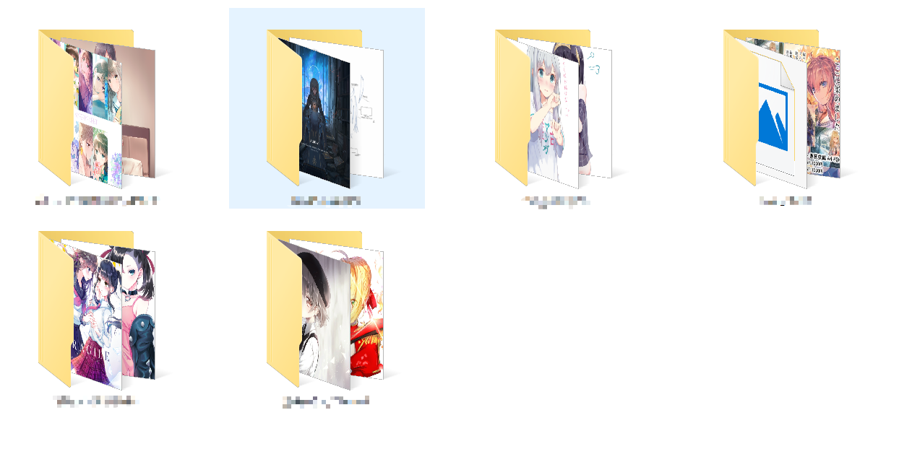
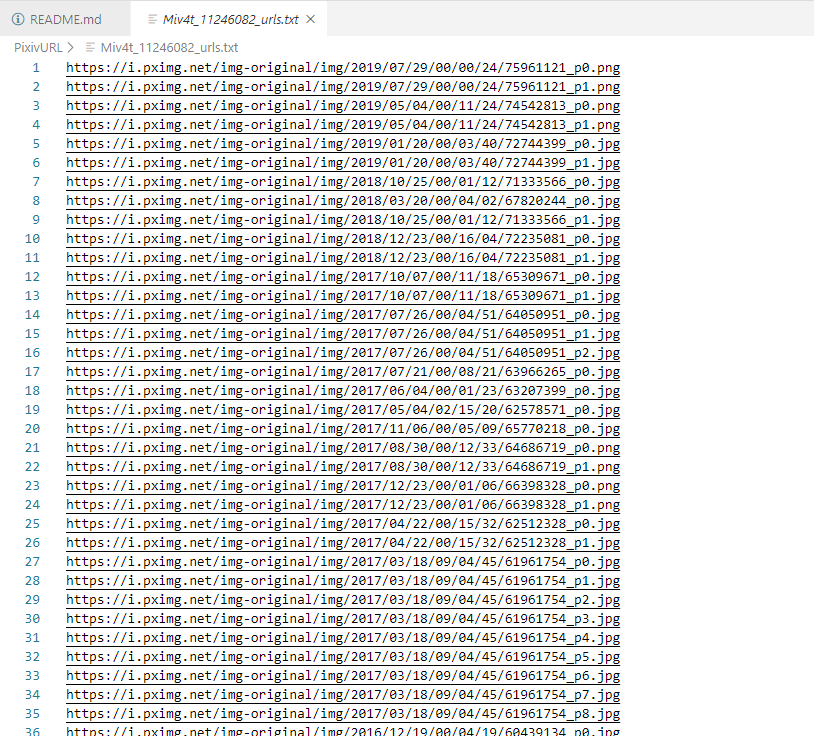

# Pixiv爬虫

起因是为了博客的的图片，找到的都是p站大触的杰作，看着实在是喜欢，网上的代码看的我头疼，毕竟不是自己写的，逻辑暂时理不清，而且也不确定是否能用，说到底还是自己太菜了。

综上我觉得实践出真理，顺手写了一个爬虫，花了一天时间，效果还算满意。

准备自己写完之后再领略别人的代码.

## 爬取效果





## 使用方法

将Cookie和作者的id设置到代码中，执行即可。代理设置就见仁见智了。
```python
if __name__ == "__main__":
    # 设置参数
    cookie = "填自己的cookie"
    userid = '填作者的id'

    # 对每一个作者建立新类
    p = pixiv(userid, cookie)

    # 写了一天，喝杯茶，冷静
    p.aoligei()
```

关于这个cookie真的是弄的我难受了

**requeset.get的`cookie`设置是 '`Cookie`'！！！！
靠调试好久 我一直填的是`Cookies`！！！**

变量名一定要填对

也没写单独图片id的下载了，我喜欢保存收集，所以一次性就直接下载作者所有作品了.

cookie有点长，也没从文件读取了，用一次改一次

关于爬取到的URL，本来是想要到数据库的，但觉得麻烦了点，大题小用，就直接存储到本地的文件中，下次有机会试试json存储应该会好读取的多。

## 关于版本

- ~~ver1.0~~ 
    - ~~大概能实现将作者id的所有作品保存并读取再下载；~~
    - ~~可能有未知bug，用函数写，方便理解些；~~
    - ~~ver2.0已经全部推倒用类改写;~~
- ver2.0
    - `Updata 2020.1.31 可用`
    - 学以致用，用类整合了所有代码，稍微简练了些；


## 结语

作为一个萌新，对python语法掌握也不是很熟练，很多地方可以更加改进，但是有些地方的写法这也是现在个人的code style，大佬们笑笑就好。

[博客](http://lyuan.co)正在慢慢起步，欢迎大家来留言.

